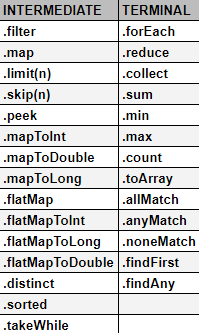
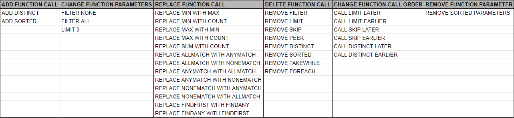
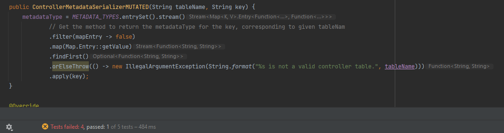
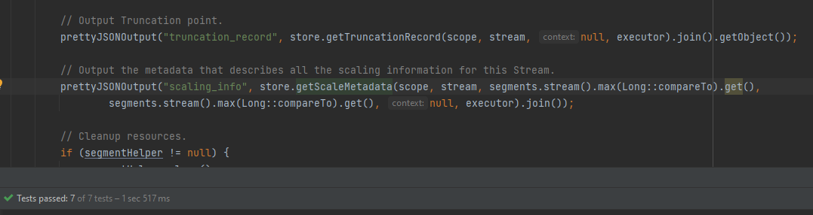
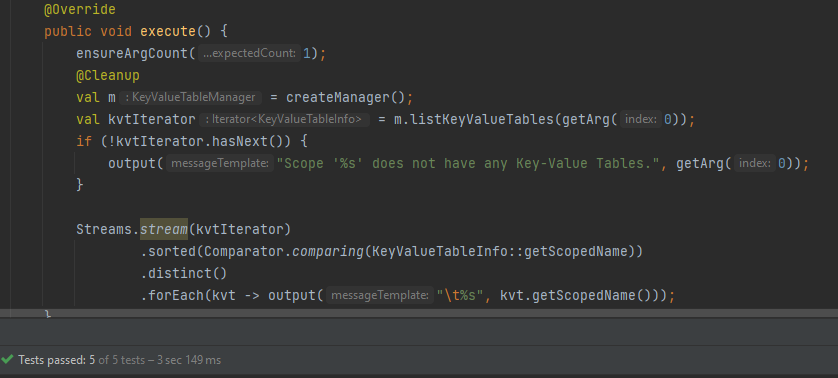

# Mutation Operators in Java Streams
Mutation testing is nowadays a consolidated work throughout the academy and there has been some programs that use the advent of the Mutation Operators to generate in-depth statistics and measurements of how good your test suite is. Inside the Java literature there has been some advancement in this area by the work of programs as PITest and µJava, but those programs do not have any Mutation Operators to work with the **Streams API**.

In face of this, our work aims to seek solutions in terms of mutation operators that function well with the Java Streams API.
## The Investigation 🕵️‍♂️
In the beginning of the research, we thought that streams and lambdas were the same thing. So, we started by applying mutants on lambdas.

To assure that even without knowing (i.e. without documenting) PITest would not mess with lambda calls, we set sail to verify it by testing.

First, we needed to find a repository that used the target API. Using the GitHub search inside the browser, we manually found the [java-8-lambdas-exercises](https://github.com/RichardWarburton/java-8-lambdas-exercises) repository by Richard Warburton, and we tried running the PIT, but we encountered some problems in the running.

Because of this, we adapted this [repository](https://github.com/eas5/java-8-lambdas-exercises) to work with PITest and we got some interesting 
results:


Looking further in this report, we were able to conclude that PITest really does not operates on lambdas (nor in streams). 

## But what if we made a manual mutant? 🤔
We tried making a manual mutant and with it we seek out to find if PITest would show some kind of report or a sign that the mutant has not been killed or was even detected.
We found a class named OrderDomain and we applied a mutation inside of it. The .mapToLong method was changed to a .mapToInt method and we ran the PITest through this mutant.


It was **not killed** by PITest.

At a first moment, we thought this was a lambda call, but in further analysis, we concluded that it was indeed streams, because the countFeature method returns a .stream() call.


With this, we could conclude that even with exhaustive work of PITest, the risk of faults that is related to the Streams API has not been touched by the program.


# Why the mutant is NOT KILLED? 💀
Knowing for sure that the mutant has not been killed by PIT, we wanted to understand why. Reading the Java 13 [documentation](https://docs.oracle.com/en/java/javase/13/docs/api/java.base/java/util/stream/package-summary.html), we could understand that we were able to swap the calls because of the category of the method.

There's two categories of calls inside the Stream API. The first one is the **intermediary** and the second one is the **terminal**.

**Intermediary** methods can be called any moment inside the stream pipeline and they do not interfere with the continuity of it. In the other way, the **terminal** ones close the pipeline, preventing any kind of interation between the stream and the rest of the program.

So, if two methods would have the same type of return and are in the same category, they could be changed without compromising the whole application.

With this in mind, we could pave the way to find new mutation operators.

# Discovering new operators 🔍

Usign the Java 13 documentation, we separated the methods by category and we thought of ways to mutate the code and make it unkillable by the test suite.



After doing the categorization, we looked upon mujava and pitest to understand their operators and we tried to mimic and adapt what they were doing, but for the streams context. So, we started by creating the applications of the mutations, such as removing function call parameters or even removing the method entirely. 
# Unboxing Mutation Operators
The new operators are these:
1. AFC - ADD FUNCTION CALL
2. CFP - CHANGE FUNCTION PARAMETERS
3. RFC - REPLACE FUNCTION CALL
4. DFC - DELETE FUNCTION CALL
5. CFCO - CHANGE FUNCTION CALL ORDER
6. RFP - REMOVE FUNCTION PARAMETER

We came with over thirty applications that could fit inside **six operators**. 



In the need of testing these operators, we searched the web for a program that uses the Streams API and for a repository that used the Streams API in the Smart City context. Over fifteen projects  that use the API were found, but their test suites had nearly to none code coverage, so we broaden our search filter and found [Pravega](https://github.com/pravega/pravega), that is an open source distributed storage system that implements Streams. Also, this application was chosen because it has a good test coverage in terms of line (82%).

With a good test suite, we would only occupy our minds with the testing of our operators. 

# The Pravega Testing 👁‍🗨
We looked for classes where there was .stream() calls and we applied our operators in five of them. They are called 
1. [ControllerMetadataSerializer](https://github.com/pravega/pravega/blob/2920577ee56000fbaf52067a1c566a038fd264c1/cli/admin/src/main/java/io/pravega/cli/admin/serializers/controller/ControllerMetadataSerializer.java#L194)
2. [KeyValueTableCommand](https://github.com/pravega/pravega/blob/e784210741e12af9021281c754d5410918a6dceb/cli/user/src/main/java/io/pravega/cli/user/kvs/KeyValueTableCommand.java#L242)
3. [ControllerDescribeStreamCommand](https://github.com/pravega/pravega/blob/00bf949a6a2d15958f4f8d3e469f70c6a9e09e10/cli/admin/src/main/java/io/pravega/cli/admin/controller/ControllerDescribeStreamCommand.java#L104)
4. [ZKHelper](https://github.com/pravega/pravega/blob/40cfb96f9b63689bc9b10c688b8b1567f8da1354/cli/admin/src/main/java/io/pravega/cli/admin/utils/ZKHelper.java#L95)
5. [SegmentStoreMetrics](https://github.com/pravega/pravega/blob/d58e537493ce9415bf1570fbfcf0a05a1698911c/segmentstore/server/src/main/java/io/pravega/segmentstore/server/SegmentStoreMetrics.java#L287)

The hyperlinks are tied to the lines where we modified something.

Now, we'll see some test from our aptitude testing.

## CFP - CHANGE FUNCTION PARAMETERS
In the first one, we applied, changing the filter parameters:
```java
//ORIGINAL
    .filter(mapEntry -> mapEntry.getKey().apply(tableName))
//MUTATED
    .filter(mapEntry -> false)
```
And this is the test result:



It only passed in one of five tests (i.e. it was killed).

### RFC - REPLACE FUNCTION CALL
In the class ControllerDescribeStreamCommand we try to replace from .min to .max
<!-- would replace be the right name? -->
```java
//ORIGINAL
prettyJSONOutput("scaling_info", store.getScaleMetadata(scope, stream, segments.stream().min(Long::compareTo).get(),

//MUTATED
prettyJSONOutput("scaling_info", store.getScaleMetadata(scope, stream, segments.stream().max(Long::compareTo).get(), 
```
And this is the result: 



It passed in seven of seven tests (i.e. it was not killed).

### AFC - ADD FUNCTION CALL
In the class KeyValueTableCommand, we try to add a .distinct call.

```java
//ORIGINAL
Streams.stream(kvtIterator)
    .sorted(Comparator.comparing(KeyValueTableInfo::getScopedName))
    .forEach(kvt -> output("\t%s",kvt.getScopedName()));

//MUTATED
Streams.stream(kvtIterator)
    .sorted(Comparator.comparing(KeyValueTableInfo::getScopedName))
    .distinct()
    .forEach(kvt -> output("\t%s",kvt.getScopedName()));
```

And this is the result:



It passed in five of five tests (i.e. it was not killed).

## Overall Results in Pravega ✅
We have applied until now seven mutant applications in seven different classes, but only in two of these applications a test could manage to kill the mutant. That gives us a passing rate of 71.42%

This could mean that our mutation operators are good and we could be able to create a research that adds value to the community and the academy.

# Evaluation 🎖
To evaluate the effectiveness of our mutation operators, we needed a comprehensive set of real faults. Thus, we searched for real-practice faults related to the Java Stream API. Using the GitHub Search API, we could find closed issues labeled as "bug" or "defect" usign the words "streams", "stream" and "lambda" as query.

We were able to find 364 different issues. 

Two researchers individually are analyzing the issues to confirm that the faults are indeed related to Stream API. In case the researchers disagree, we disregard such a fault. For each fault, the researchers review the code before and after the fixing commit. The idea here is to follow the opposite path of the bug fix, i.e., given the fixed code, is there any mutation operator  able to create a mutant that mimics the fault that has been fixed?

This is nowadays.


